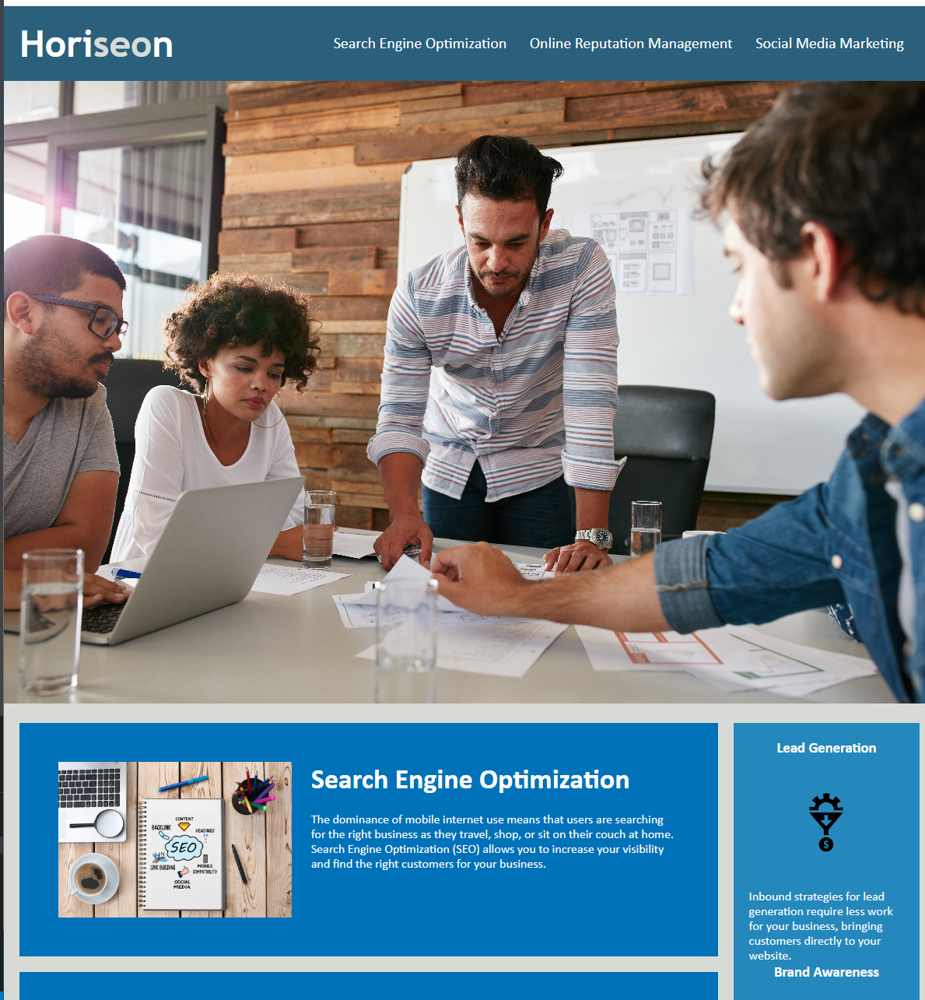

# Module-1-Challenge
[live website](https://domspadafora.github.io/Module-1-Challenge/)

-Restructured the html code for the Horiseon website to follow accessibility standards.



## User Story

```
AS A marketing agency
I WANT a codebase that follows accessibility standards
SO THAT our own site is optimized for search engines
```

## Acceptance Criteria

```
GIVEN a webpage meets accessibility standards
WHEN I view the source code
THEN I find semantic HTML elements
WHEN I view the structure of the HTML elements
THEN I find that the elements follow a logical structure independent of styling and positioning
WHEN I view the icon and image elements
THEN I find accessible alt attributes
WHEN I view the heading attributes
THEN they fall in sequential order
WHEN I view the title element
THEN I find a concise, descriptive title


## Changes Made

-added sementic tags to all div tags. 
-made necessary changes to the styles.css page if needed
-fixed the link at the top of the page "search engine optimization


